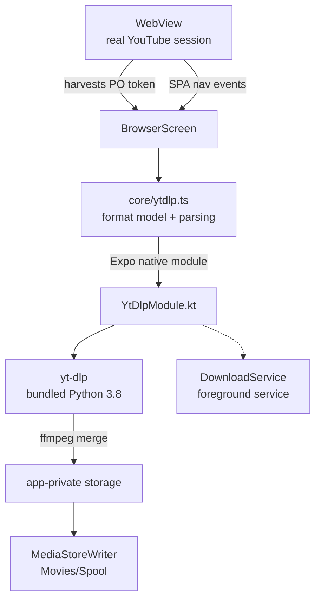

# Spool

A YouTube browser for Android with a download button that covers **zero pixels** of the page.

No ads. No account. No tracking. The app lives in a bar at the bottom of the screen; the page above it is never overlaid, never injected with a floating bubble, never interrupted.

> **Android only.** Spool is not on the Play Store and never will be — see [Distribution](#distribution).

---

## Why it works when other downloaders don't

Since 2025, essentially every YouTube stream request needs a **PO Token** (Proof-of-Origin). Without one you get `HTTP 403`. Tokens are minted by BotGuard inside a real browser session, are session-bound, and expire quickly.

This is what kills standalone downloader apps. They have no browser session to attest with, so they bolt on external token-provider services and fight a losing battle against every extraction change.

Spool *is* a browser. It has a real WebView, a real visitor session, real cookies, and a real BotGuard execution environment — not as a workaround, but as a side effect of the product being a browser in the first place. Harvesting a valid PO token is a natural capability of this architecture and a painful hack for everyone else.

Two things follow from that:

- **The token is genuine.** Spool reads the token the page already minted for its own playback ([`src/browser/potoken.ts`](src/browser/potoken.ts)) rather than reimplementing attestation.
- **The token is a web-client token.** It only validates against web-client requests, so the extractor is pinned to `player_client=web`. Skip that pin and yt-dlp asks as `tv`/`ios`, the token is ignored, and the media fetch 403s.

## Architecture



| Layer | What it does |
| --- | --- |
| [`src/browser/`](src/browser/) | WebView chrome, SPA navigation tracking, PO token harvest, cosmetic ad blocking |
| [`src/core/engine.ts`](src/core/engine.ts) | Platform-agnostic type + interface seams so iOS stays possible |
| [`src/core/ytdlp.ts`](src/core/ytdlp.ts) | Format parsing, dedupe, and yt-dlp format-selector construction |
| [`modules/ytdlp/`](modules/ytdlp/) | Expo native module wrapping [youtubedl-android](https://github.com/JunkFood02/youtubedl-android) |
| [`src/sheets/`](src/sheets/), [`src/screens/`](src/screens/) | Quality picker, downloads list, settings, first-run notice |

A few decisions worth knowing:

- **Format parsing is in TypeScript, not Kotlin.** The native side returns yt-dlp's raw `--dump-single-json` and nothing else, so the `Format` model has exactly one definition.
- **Merging uses yt-dlp's bundled ffmpeg**, not Android's `MediaMuxer`. `MediaMuxer` cannot handle every codec pair YouTube serves.
- **The extractor updates itself at runtime.** Spool can't ship Play Store updates, so `updateEngine()` pulling a newer yt-dlp is the app's self-repair path when YouTube changes something.
- **Downloads run in a foreground service** and are published to `Movies/Spool` via MediaStore, so they survive the app being backgrounded.

## Privacy

Spool stores what you downloaded and whether you've seen the first-run screen. That is the entire persisted state — see [`src/core/storage.ts`](src/core/storage.ts). No analytics, no identifiers, no network calls to anything but YouTube.

## Build

Requires Node 20+, a JDK 17, and the Android SDK.

```bash
npm install
npx expo run:android
```

The `android/` directory is generated and not checked in; `expo run:android` runs `prebuild` for you. To regenerate it explicitly:

```bash
npx expo prebuild --platform android
```

Type-check with:

```bash
npm run typecheck
```

### Build notes

- `minSdk 24`, `targetSdk 36`, Kotlin JVM target 17.
- Native ABIs are limited to `arm64-v8a`, `armeabi-v7a`, `x86_64`. youtubedl-android ships a full Python runtime per ABI, so including all four roughly doubles the APK for a device class almost nobody runs.
- `useLegacyPackaging` is on: the bundled Python payload is a zip that must stay uncompressed to be extractable at runtime.

## Distribution

YouTube's developer policies prohibit letting users download videos for offline play outside of YouTube Premium, and Google Play enforces this. Apps in this category get removed — sometimes at review, often after publishing. Apple's App Store is stricter still.

So Spool is distributed by sideload: APK from GitHub Releases, or via [Obtainium](https://github.com/ImranR98/Obtainium). This is well-trodden ground — Seal, YTDLnis, and NewPipe all live here.

## Legal

**Downloading from YouTube violates YouTube's Terms of Service.** Spool shows this plainly on first run, and it is worth repeating here.

Beyond ToS, the legal picture is genuinely jurisdiction-dependent. Several EU countries have private-copying exceptions. US law is unsettled — GitHub reinstated youtube-dl in 2020 after the RIAA takedown, backed by the EFF's argument that it circumvents no technical protection measure — while German courts have gone the other way on stream-rippers. PO-token handling sits closer to "circumventing an access control" than plain downloading does.

Spool is built for the uses that are clearly legitimate: **your own uploads, Creative Commons and public-domain material, and personal offline use where your local law allows it.** You are responsible for what you download with it.

This is not legal advice.

## License

MIT — see [LICENSE](LICENSE).

Spool bundles [yt-dlp](https://github.com/yt-dlp/yt-dlp) (Unlicense) and [ffmpeg](https://ffmpeg.org/) via [youtubedl-android](https://github.com/JunkFood02/youtubedl-android) (GPL-3.0). If you redistribute builds, mind that ffmpeg's licensing terms travel with the binary.
