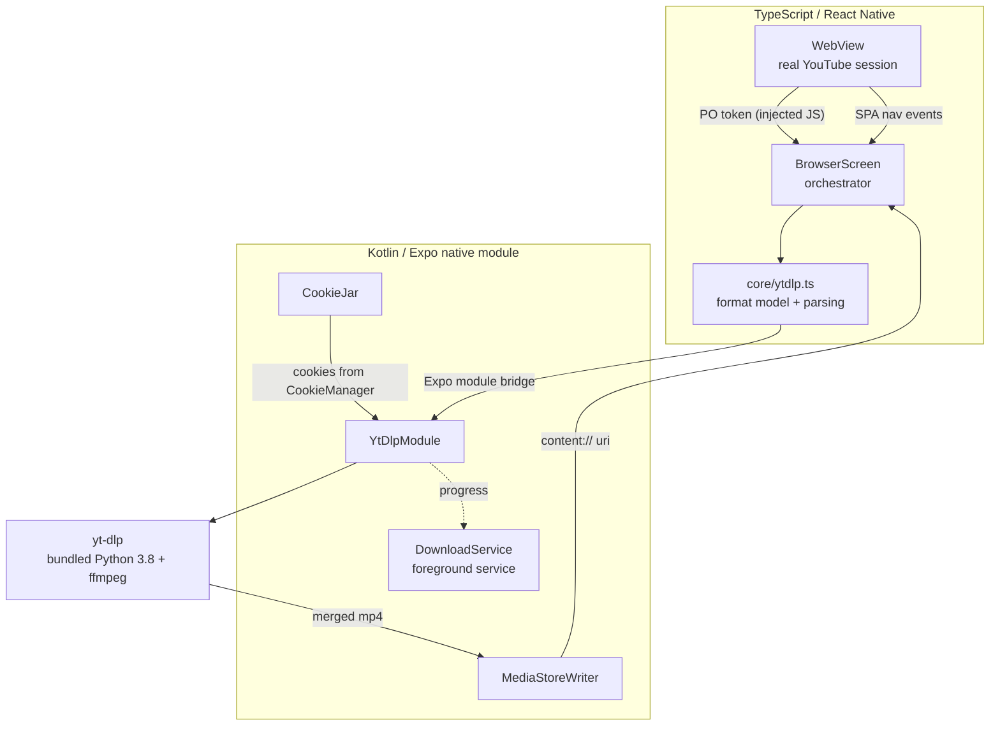

# Spool

**A YouTube browser for Android with a download button that covers zero pixels of the page.**

No ads. No account. No tracking. No floating bubble. The app lives in a bar at the bottom of the screen, and the page above it is never overlaid, never interrupted, and never hijacked.

> **Android only.** Spool is not on the Play Store and never will be — see [Distribution](#distribution).

## Download

**[⬇ Get the latest APK](https://github.com/pardeepsinghverma/Spool/releases/latest)**

Android 7.0 (API 24) or newer. You'll need to allow installs from unknown sources — Android prompts for this the first time.

Releases ship one APK per CPU architecture:

| File | For |
| --- | --- |
| `spool-<version>-arm64-v8a.apk` | **Almost certainly this one** — every phone since ~2016 |
| `spool-<version>-armeabi-v7a.apk` | Older 32-bit devices |
| `spool-<version>-x86_64.apk` | Emulators, ChromeOS |

Splitting by architecture is not cosmetic here: yt-dlp ships a Python runtime and an ffmpeg build *per ABI*, so a universal APK carries four copies of each and lands at ~226 MB. Per-ABI builds are roughly a third of that.

Verify before installing:

```bash
sha256sum -c SHA256SUMS.txt --ignore-missing
```

---

## Contents

- [What it is](#what-it-is)
- [Why it works when other downloaders don't](#why-it-works-when-other-downloaders-dont)
- [Architecture](#architecture)
- [How a download actually happens](#how-a-download-actually-happens)
- [The hard parts, explained](#the-hard-parts-explained)
- [Interface design](#interface-design)
- [Privacy](#privacy)
- [Project layout](#project-layout)
- [Build and run](#build-and-run)
- [Cutting a release](#cutting-a-release)
- [Troubleshooting](#troubleshooting)
- [Known limitations](#known-limitations)
- [Distribution](#distribution)
- [Legal](#legal)
- [License](#license)

---

## What it is

Spool is a WebView browser pointed at YouTube, plus a native download engine. You browse normally. When a video is on screen, the download button in the bottom bar wakes up. Tap it, pick a quality, and the file lands in your gallery.

The design constraint that shapes everything: **the app never draws on top of the page.** Every incumbent in this category — Vidmate, Snaptube, TubeMate — puts a floating bubble over your video. Spool's entire UI surface while browsing is a bar below the page, and the only pixel it draws touching the page boundary is a 2dp load line that touches it from below.

**What you get:**

- Browse YouTube with cosmetic and player-response ad blocking
- Download video at any resolution YouTube offers, or extract audio to `.m4a`
- A quality picker that takes three taps maximum, never a raw format table
- Downloads run in a foreground service and survive backgrounding
- Files published to `Movies/Spool` (or `Music/Spool` for audio) and visible in Gallery
- The extraction engine updates itself at runtime
- Dark and light themes that follow the page you're looking at
- No analytics, no identifiers, no accounts

## Why it works when other downloaders don't

Since 2025, essentially every YouTube stream request needs a **PO Token** (Proof-of-Origin). Without one you get `HTTP 403`. Tokens are minted by BotGuard inside a real browser session, are bound to that session, and expire quickly.

This is what kills standalone downloader apps. They have no browser session to attest with, so they bolt on external token-provider services and fight a losing battle against every extraction change YouTube ships.

**Spool is a browser.** It has a real WebView, a real visitor session, real cookies, and a real BotGuard execution environment — not as a workaround, but as a side effect of the product being a browser in the first place. Harvesting a valid PO token is a natural capability of this architecture and a painful hack for everyone else.

The same advantage applies twice more: the WebView holds a genuine, user-consented YouTube session whose cookies (including `HttpOnly` ones that `document.cookie` cannot see) can be handed to yt-dlp, and the page's own DOM is available for ad-stripping before its scripts run.

## Architecture



| Layer | Responsibility |
| --- | --- |
| [`src/browser/`](src/browser/) | WebView chrome, SPA navigation tracking, PO token harvest, ad blocking |
| [`src/core/engine.ts`](src/core/engine.ts) | Platform-agnostic types and interface seams so iOS stays possible |
| [`src/core/ytdlp.ts`](src/core/ytdlp.ts) | Format parsing, dedupe, format-selector construction |
| [`src/core/storage.ts`](src/core/storage.ts) | The entire persisted state (download history, first-run flag) |
| [`src/sheets/`](src/sheets/), [`src/screens/`](src/screens/) | Quality picker, downloads list, settings, first-run notice |
| [`src/ui/`](src/ui/) | Design tokens and theme context |
| [`modules/ytdlp/`](modules/ytdlp/) | Expo native module wrapping [youtubedl-android](https://github.com/JunkFood02/youtubedl-android) |

### A note on where the logic lives

Format parsing is in **TypeScript, not Kotlin**. The native side runs `--dump-single-json` and returns yt-dlp's raw output verbatim; everything downstream of that is TypeScript. This keeps the `Format` model to exactly one definition instead of a Kotlin data class and a TS type drifting apart.

## How a download actually happens

1. **You navigate.** Injected JS reports the new URL, title, and page theme back to the app ([`youtube.ts`](src/browser/youtube.ts)). [`extractVideoId`](src/browser/youtube.ts) pulls the ID out of a `watch`, `shorts`, `embed`, or `youtu.be` URL.
2. **The button wakes up.** A video ID on the page moves the download button from `idle` to `ready`.
3. **You tap it.** `listFormats` runs yt-dlp's `--dump-single-json` with the harvested PO token and the browser's cookies.
4. **Formats are parsed and deduped.** yt-dlp lists many near-identical rungs; [`dedupe`](src/core/ytdlp.ts) keeps the largest per `(resolution, muxed)` pair, drops storyboards, and sorts video before audio.
5. **The sheet opens** with at most three quick picks — Best, a preferred 1080p rung, and Audio only — with the full format table one tap deeper.
6. **You pick.** A format selector is built: `137+bestaudio/best` for video-only streams, the bare ID when the stream is already muxed.
7. **The foreground service starts**, so Android won't kill the process when you leave the app.
8. **yt-dlp downloads** into app-private storage, merging the DASH video and audio streams with its bundled ffmpeg. Progress streams back over an Expo event.
9. **MediaStoreWriter publishes** the file to `Movies/Spool`, and deletes the temp copy.
10. **The record is saved** to AsyncStorage and the button turns into a checkmark.

## The hard parts, explained

### PO tokens and client pinning

A PO token is bound to the client that minted it. Spool's comes from the web page, so it is a **web** token and only validates against **web-client** requests. If you pass the token without pinning the client, yt-dlp identifies as `tv` or `ios`, the token is silently ignored, and the media fetch 403s.

So [`applyExtractorArgs`](modules/ytdlp/android/src/main/java/com/afinitycode/spool/ytdlp/YtDlpModule.kt) always sends them together:

```
--extractor-args "youtube:player_client=web;po_token=web.gvs+<token>;visitor_data=<data>"
```

Two subtleties that cost real debugging time:

- **`visitor_data` alone is worse than nothing.** It pins requests to a session you have no attestation for. It is only sent alongside a token.
- **yt-dlp *replaces* rather than merges repeated `--extractor-args`** for the same extractor. Passing these as separate options silently drops all but the last. They must be joined with `;` into one option.

### Cookie handoff

[`CookieJar`](modules/ytdlp/android/src/main/java/com/afinitycode/spool/ytdlp/CookieJar.kt) reads the WebView's session via Android's `CookieManager` — which sees `HttpOnly` cookies that page JavaScript cannot — and writes them to a Netscape-format cookie file for yt-dlp's `--cookies`.

Details that matter: cookies are collected across `www.youtube.com`, `m.youtube.com`, `.youtube.com`, and `www.google.com` (consent lives there), de-duplicated by name, and stamped with a far-future expiry so yt-dlp doesn't discard them as session cookies. If the session has no cookies, `write()` returns `null` and the caller omits `--cookies` entirely rather than passing an empty file.

### SPA navigation

YouTube is a single-page app. `pushState`/`replaceState` change the route without a page load, so the WebView's own `onNavigationStateChange` misses most in-app navigation and the download button goes stale on the wrong video.

[`NAV_SCRIPT`](src/browser/youtube.ts) covers this four ways: it patches both history methods, listens for YouTube's own `yt-navigate-finish`, observes `<title>` mutations (which land *after* the route change), and keeps a 1-second poll as a safety net. Reports are de-duplicated against the last payload so the four sources don't cause redundant work.

The same script reports the page's **background luminance**, which is how the bottom bar knows whether YouTube is currently rendering dark or light. It walks up from `document.body` until it finds a painted background — treating `rgba(0,0,0,0)` as black would read every page as dark.

### Ad blocking

Three layers, because YouTube's ads are not one thing ([`adblock.ts`](src/browser/adblock.ts)):

1. **Player-response stripping** — pre-roll and mid-roll are described in the InnerTube player response, not fetched from a blockable ad host. Deleting `adPlacements`, `playerAds`, `adSlots` and friends before YouTube's JS reads them means the player never learns there was an ad. *This is the layer that matters.*
2. **Cosmetic filtering** — feed promos, mastheads, companion slots. DOM only.
3. **Skip fallback** — if an ad slips through, skip or seek past it.

Layers 1 and 3 must beat the page's own scripts, so they're injected via `injectedJavaScriptBeforeContentLoaded`.

### Merging

Merging uses **yt-dlp's bundled ffmpeg** (`--merge-output-format mp4`), not Android's `MediaMuxer`. `MediaMuxer` cannot handle every codec pair YouTube serves. Audio extraction uses `-x --audio-format m4a`.

### Publishing to the gallery

Writing a file to app-private storage — or even dropping it into `Movies/` with raw file I/O — leaves it **invisible to Gallery** on modern Android. Only a MediaStore record makes it appear.

[`MediaStoreWriter`](modules/ytdlp/android/src/main/java/com/afinitycode/spool/ytdlp/MediaStoreWriter.kt) inserts with `IS_PENDING=1`, streams the file in, then clears the flag — so a half-copied file is never visible. On failure it deletes the orphaned row. Below API 29 it falls back to the legacy `DATA` column. Filenames are sanitised of `\/:*?"<>|` and capped at 120 characters.

### The foreground service

[`DownloadService`](modules/ytdlp/android/src/main/java/com/afinitycode/spool/ytdlp/DownloadService.kt) keeps the process alive while yt-dlp works, and owns the one surface this app has outside its own window.

The ongoing notification is **silent and non-dismissible** with a CANCEL action; the completion notice is **dismissible, low priority, and never makes a sound**. Both channels are created with `IMPORTANCE_LOW`, no sound, no vibration. `YtDlpCancelBus` routes the notification's CANCEL action to the running yt-dlp process.

### Self-repair

Spool can't ship Play Store updates, so when YouTube changes something, `updateEngine()` pulls a newer yt-dlp at runtime. This is the app's only path back to working, which is why it's a first-class button in Settings and an offered remedy in the error sheet.

## Interface design

**The download button** is six states in one 48dp square ([`DownloadButton.tsx`](src/browser/DownloadButton.tsx)):

| State | Icon | Meaning |
| --- | --- | --- |
| `idle` | download | No video on this page |
| `ready` | download | Video detected — accented and pulsing once per navigation |
| `resolving` | download | Finding available formats |
| `working` | stop | Downloading, with a progress ring; tap cancels |
| `done` | check | Saved; tap opens Downloads |
| `failed` | refresh | Tap retries |

Every state carries an explicit accessibility label, and animation respects the OS reduce-motion setting.

**The pill** is the app's only sentence. Three modes ranked by right-of-interruption: status outranks host, error outranks status. Status and error are temporary tenants — the pill always returns to showing the current host.

**The quality sheet** never shows a raw format table on the front sheet; that's the incumbent mistake. Quick picks first, full list one tap deeper. Formats too large for free storage dim rather than disappear. Failures that block an action you just took replace the sheet contents in place, rather than throwing you back to the page.

**Theming** is two palettes with identical token names ([`theme.ts`](src/ui/theme.ts)). The bar reads the page's theme from the WebView and swaps the set; nothing else in the system branches on theme. Everything is expressible in React Native `StyleSheet` — flat fills, borders, opacity, transform. No gradients, no shadow spread, no filters.

## Privacy

Spool persists exactly two things ([`storage.ts`](src/core/storage.ts)): what you downloaded, and whether you've seen the first-run screen. History is capped at 200 entries. There are no analytics, no identifiers, and no network calls to anything but YouTube and Google.

Two things worth stating plainly:

- **Your YouTube session cookies are written to a file** in the app's cache directory so yt-dlp can use them. They stay on-device, in app-private storage, and are never transmitted anywhere except to YouTube as part of a normal request.
- **If you sign in to YouTube in the browser**, downloads act as your account. That is what makes members-only and age-restricted content resolvable, and it's also why it's worth knowing.

## Project layout

```
├── App.tsx                      Root: SafeArea + Theme providers
├── index.ts                     Expo entry point
├── plugins/
│   ├── withReleaseSigning.js    Injects release signing into generated Gradle
│   └── withAbiSplits.js         One APK per architecture instead of a 226 MB one
├── .github/workflows/
│   └── release.yml              Tag → signed APK → GitHub Release
├── src/
│   ├── browser/
│   │   ├── BrowserScreen.tsx    Orchestrator: WebView, download flow, routing
│   │   ├── BrowserChrome.tsx    The bottom bar — the app's whole UI surface
│   │   ├── DownloadButton.tsx   Six states, one 48dp square, progress ring
│   │   ├── Pill.tsx             Status / host / error readout
│   │   ├── adblock.ts           Three-layer ad blocking, injected pre-load
│   │   ├── potoken.ts           PO token harvesting from the live page
│   │   ├── youtube.ts           URL parsing + SPA navigation reporting
│   │   └── formatView.ts        Format → quick picks and table rows
│   ├── core/
│   │   ├── engine.ts            Platform-agnostic types and seams
│   │   ├── ytdlp.ts             Engine bridge, parsing, dedupe, selectors
│   │   └── storage.ts           AsyncStorage persistence
│   ├── screens/
│   │   ├── FirstRunScreen.tsx   One screen, once — including the legal notice
│   │   ├── DownloadsScreen.tsx  History with retry and remove
│   │   └── SettingsScreen.tsx   Engine version and manual update
│   ├── sheets/QualitySheet.tsx  Quality picking and its failure modes
│   └── ui/                      Design tokens, theme context
└── modules/ytdlp/               Expo native module
    ├── index.ts                 Typed JS surface for the native module
    └── android/src/main/java/com/afinitycode/spool/ytdlp/
        ├── YtDlpModule.kt       Bridge: initialize, listFormats, download, cancel, update
        ├── CookieJar.kt         WebView session → Netscape cookie file
        ├── DownloadService.kt   Foreground service + notifications
        └── MediaStoreWriter.kt  Publishes finished files to Gallery
```

## Build and run

**Requirements:** Node 20+, JDK 17, Android SDK, and a device or emulator on API 24+.

```bash
npm install
npx expo run:android
```

The `android/` directory is generated and not checked in — `expo run:android` runs `prebuild` for you. To regenerate it explicitly:

```bash
npx expo prebuild --platform android
```

Type-check with:

```bash
npm run typecheck
```

### Build configuration

- `minSdk 24`, `targetSdk 36`, `compileSdk 36`, Kotlin JVM target 17.
- Release builds are **split per ABI** ([`withAbiSplits.js`](plugins/withAbiSplits.js)) into `arm64-v8a`, `armeabi-v7a`, and `x86_64`. `x86` is dropped as emulator-only. Beware: the `abiFilters` in the ytdlp module does *not* control this — it constrains that module's own native compilation, not the jniLibs the youtubedl-android AAR brings in transitively.
- `useLegacyPackaging` is on in both [`app.json`](app.json) and [`build.gradle`](modules/ytdlp/android/build.gradle): the bundled Python payload is a zip that must stay uncompressed to be extractable at runtime. Turning this off produces an app that builds fine and fails at first download.
- The WebView presents a **plain Chrome user agent**. Android's stock WebView UA contains `; wv`, which Google rejects on its sign-in flows.

### Permissions

| Permission | Why |
| --- | --- |
| `INTERNET`, `ACCESS_NETWORK_STATE` | Fetching |
| `FOREGROUND_SERVICE`, `FOREGROUND_SERVICE_DATA_SYNC` | Downloads that survive backgrounding |
| `POST_NOTIFICATIONS` | Progress notification — declined only costs the notification |
| `WAKE_LOCK` | Keeps long downloads alive |
| `WRITE_EXTERNAL_STORAGE` | API ≤ 28 only; scoped storage handles it after that |

## Cutting a release

Releases are built by [GitHub Actions](.github/workflows/release.yml) and published to GitHub Releases:

```bash
git tag v1.0.1
git push origin v1.0.1
```

The workflow checks out clean, runs `expo prebuild`, builds a signed release APK, refuses to continue if the result is debug-signed, and attaches the APK plus a SHA-256 checksum to the release.

### Signing

`android/` is generated and gitignored, so a hand-edit to its `build.gradle` lasts exactly until the next prebuild. Signing is therefore applied by an Expo config plugin, [`plugins/withReleaseSigning.js`](plugins/withReleaseSigning.js), which runs *as part of* prebuild and so survives regeneration — including on a clean CI checkout.

The plugin never contains credentials. It injects Gradle that reads four properties:

| Property | Meaning |
| --- | --- |
| `SPOOL_STORE_FILE` | Absolute path to the `.jks` |
| `SPOOL_STORE_PASSWORD` | Keystore password |
| `SPOOL_KEY_ALIAS` | Key alias |
| `SPOOL_KEY_PASSWORD` | Key password |

Supply them via `-P` flags, `~/.gradle/gradle.properties`, or `ORG_GRADLE_PROJECT_*` environment variables. **When `SPOOL_STORE_FILE` is absent, release builds fall back to debug signing** — so contributors without a keystore can still build, and CI hard-fails rather than shipping a debug-signed artifact.

For CI, add these repository secrets under Settings → Secrets and variables → Actions:

`KEYSTORE_BASE64` (base64 of the `.jks`), `KEYSTORE_PASSWORD`, `KEY_ALIAS`, `KEY_PASSWORD`.

> **Keep the keystore backed up.** Android identifies an app by its signing key. Lose it and you cannot ship an update — every user has to uninstall and reinstall, losing their download history.

### Building an APK locally

```bash
npm run apk
```

Output lands in `android/app/build/outputs/apk/release/`. Without signing properties configured this produces a debug-signed APK, which is fine for testing and unfit for distribution.

## Troubleshooting

**Everything 403s.** The PO token is missing or the client isn't pinned. Spool logs `[spool] download token: poToken=yes|NO visitorData=yes|NO` at the start of every download — check that first. A `NO` means the harvest didn't run; play the video briefly and retry.

**"Extraction failed — try updating the engine".** YouTube changed something. Settings → update the engine. This is the expected failure mode and the expected fix.

**First download is slow to start.** Extracting the bundled Python happens once. Spool warms it at app boot to hide this, but a cold first launch straight into a download will wait.

**Downloads don't appear in Gallery.** They're published to `Movies/Spool` via MediaStore. Some gallery apps cache aggressively; the file is there.

**Sign-in fails.** Check the user agent hasn't been changed to something containing `wv`.

## Known limitations

- **Android only.** The `DownloadEngine`, `Muxer`, and `TokenProvider` interfaces in [`engine.ts`](src/core/engine.ts) exist as porting seams but have no second implementation.
- **Live streams are not supported.**
- **Server-side stitched ads (SSAI)** are part of the video stream itself and survive all three blocking layers.
- **Anti-adblock detection** is an arms race on the same treadmill as extraction, and breaks for the same reasons.
- **No network-level blocking.** True Brave parity would need a native `shouldInterceptRequest` hook, which Spool doesn't attempt.
- **"Open in gallery"** in the downloads list is currently a no-op.
- **"Choose folder"** on the first-run screen doesn't open a picker — the destination is fixed to `Movies/Spool`.
- **No playlist support.** `--no-playlist` is passed everywhere; one video at a time.

## Distribution

YouTube's developer policies prohibit letting users download videos for offline play outside of YouTube Premium, and Google Play enforces this. Apps in this category get removed — sometimes at review, often after publishing. Apple's App Store is stricter still.

So Spool is distributed by sideload: [APK from GitHub Releases](https://github.com/pardeepsinghverma/Spool/releases/latest), or via [Obtainium](https://github.com/ImranR98/Obtainium), which watches this repo and auto-updates from it. This is well-trodden ground — Seal, YTDLnis, and NewPipe all live here.

Because there's no store doing it for you, **releases are the update channel**, and the in-app engine updater is what keeps a given build working between them.

## Legal

**Downloading from YouTube violates YouTube's Terms of Service.** Spool says so on first run, and it's worth repeating here.

Beyond ToS, the legal picture is genuinely jurisdiction-dependent. Several EU countries have private-copying exceptions. US law is unsettled — GitHub reinstated youtube-dl in 2020 after the RIAA takedown, backed by the EFF's argument that it circumvents no technical protection measure — while German courts have gone the other way on stream-rippers. PO-token handling sits closer to "circumventing an access control" than plain downloading does.

Spool is built for the uses that are clearly legitimate: **your own uploads, Creative Commons and public-domain material, and personal offline use where your local law allows it.** You are responsible for what you download with it.

This is not legal advice.

## License

MIT — see [LICENSE](LICENSE).

Spool bundles [yt-dlp](https://github.com/yt-dlp/yt-dlp) (Unlicense) and [ffmpeg](https://ffmpeg.org/) via [youtubedl-android](https://github.com/JunkFood02/youtubedl-android) (GPL-3.0). **If you redistribute builds, ffmpeg's licensing terms travel with the binary** — the APK as a whole is subject to GPL-3.0, even though this source tree is MIT.
